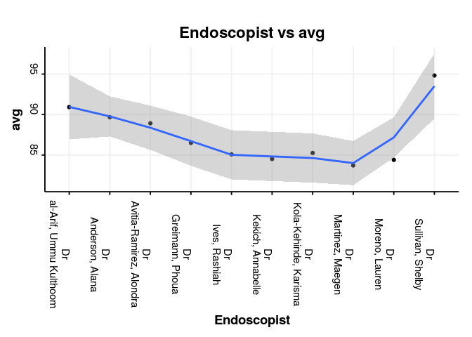

[](https://travis-ci.org/sebastiz/EndoMineR) [](https://github.com/ropensci/onboarding/issues/153) [](https://codecov.io/github/sebastiz/EndoMineR?branch=master)

<!-- README.md is generated from README.Rmd. Please edit that file -->
EndoMineR
=========

The goal of EndoMineR is to extract as much information as possible from endoscopy reports and their associated pathology specimens. The package is intended for use by gastroenterologists, pathologists and anyone interested in the analysis of endoscopic and ppathological datasets

<br>

Gastroenterology now has many standards against which practice is measured although many reporting systems do not include the reporting capability to give anything more than basic analysis. Much of the data is locked in semi-structured text.

<br>

However the nature of semi-structured text means that data can be extracted in a standardised way- it just requires more manipulation. This package provides that manipulation so that complex endoscopic-pathological analyses, in line with recognised standards for these analyses, can be done.

The package is basically in three parts

1.  **The extraction**- This is really when the data is provided as full text reports. You may already have the data in a spreadsheet in which case this part isn't necessary

2.  **Cleaning**- These are a group of functions that allow the user to extract and clean data commonly found in endoscopic and pathology reports. The cleaning functions usually remove common typos or extraneous information and do some reformatting

3.  **Analyses**- The analyses provide graphing function as well as analyses according to the cornerstone questions in gastroenterology- namely surveillance, patient tracking, quality of endoscopy and pathology reporting and diagnostic yield questions.

Installation
------------

You can install EndoMineR from github with:

``` r
# install.packages("devtools")
devtools::install_github("sebastiz/EndoMineR")
```

If you dont have access to github, then download the zip and change the working dirctory to the place you have downloaded it, then do

``` r
setwd("C:/Users/Desktop/")

#On windows you cand cd to change the directory or us pushd to create a temporary directory indtead of cd and then setwd to the temporary directory
unzip("EndoMineR.zip")
file.rename("EndoMineR.zip-master", "EndoMineR.zip")
shell("R CMD build EndoMineR.zip")

#Then install the resulting tarball with:

install.packages("EndoMineR_0.2.0.9000.tar.gz", repos = NULL)
```

Getting started
---------------

<br>

**The data input**

As long as your data has been inputted, the package should be pretty easy to use. It really is designed to use whole text reports, but if you have data already in columns that is not a problem. Before you use the main function you just have to process your spreadsheet with EndoPaste and go from there...

Here is an example data set which is loaded with the package. There are several. We will use the TheOGDReportFinal dataset which is a dataframe of (synthetically created) endoscopy reports

<table style="width:44%;">
<colgroup>
<col width="44%" />
</colgroup>
<thead>
<tr class="header">
<th align="center">OGDReportWhole</th>
</tr>
</thead>
<tbody>
<tr class="odd">
<td align="center">Hospital: Random NHS Foundation Trust Hospital Number: J6044658 Patient Name: Jargon, Victoria General Practitioner: Dr. Martin, Marche Date of procedure: 2009-11-11 Endoscopist: Dr. Sullivan, Shelby 2nd Endoscopist: Dr. al-Basha, Mahfoodha Medications: Fentanyl 12.5mcg Midazolam 6mg Instrument: FG5 Extent of Exam: GOJ Indications: Follow-up ULCER HEALING Procedure Performed: Gastroscopy (OGD) Findings: No evidence of Barrett's oesophagus, short 2 cn hiatus hernia.,Oesophageal biopsies taken from three levels as requested.,OGD today to assess for ulceration/ongoing bleeding.,Diaphragmatic pinch:40cm .,She has a small hiatus hernia .,We will re-book for 2 weeks, rebanding.,Tiny erosions at the antrum.,Biopsies taken from top of stricture-metal marking clips in situ.,The varices flattened well with air insufflation.,He is on Barrett's Screeling List in October 2017 at St Thomas'. HALO 90 done with good effect Endoscopic Diagnosis: Post chemo-radiotherapy stricture</td>
</tr>
</tbody>
</table>

Assuming you have whole reports you need to enter the subtitles that delineate the sections of your text, and then run the textPrep function.

``` r
mywords<-c("Hospital Number","Patient Name:","DOB:","General Practitioner:",
 "Date received:","Clinical Details:","Macroscopic description:",
 "Histology:","Diagnosis:")
textPrep(PathDataFrameFinal$PathReportWhole,mywords,NegEx="TRUE",Extractor="1")
```

The parameters indicate whether you want to get rid of Negative phrases from your text \`\`\`\` and which Extractor you want to use (1 means you know the subtitles are always in the same order, 2 means they are sometimes missing) <br>

This function should be used for both histology and pathology datasets separately.

### The merging function

Once the histology and endoscopy datasets have been cleaned, if you wish (and want to run some of the analysis functions later in the package) you can merge the endoscopy and pathology datasets. This has been provided as a convenience function EndoMerge2 and merges the datasets based on the date performed (with some flexibility given pathology received is not always the same as the endoscopy date).

``` r
v<-Endomerge2(Myendo,'Dateofprocedure','HospitalNumber',Mypath,'Dateofprocedure','HospitalNumber')
```

### The analyses

The overall aim is to provide functions that allow the user to perform complex analyses on the endoscopic-pathological datasets. As far as possible the analyses are based on guidelines developed by the British Society of Gastroenterology. These analyses will expand in further iterations. Generic analyses functions are provided for example, as various numeric analyses plotted by endoscopist.

``` r
library(EndoMineR)
MyendoNew<-cbind(EndoscMeds(Myendo$Medications),Myendo)
# Now lets look at the fentanly use per Endoscopist:
FentByEndo<-MetricByEndoscopist(MyendoNew,'Endoscopist','Fent')

#Now lets plot it with the publication ready plotter function EndoBasicGraph:

EndoBasicGraph(FentByEndo, "Endoscopist", "avg")
#> Warning: `legend.margin` must be specified using `margin()`. For the old
#> behavior use legend.spacing
```



More specific analyses, ie those relating to a specific guidelines are also provided. For example in the case of Barrett's oesophagus, the follow-up timing for the next endoscopy in those who have non dysplastic mucosa, can be determined as follows:

``` r
v<-Endomerge2(Myendo,"Dateofprocedure","HospitalNumber",Mypath,"Dateofprocedure","HospitalNumber")

#Just grab the Barretts surveillance gastroscopies
v<-v[grepl("[SS]urv",v$Indications),]
b<-Barretts_PragueScore(v, "Findings", "OGDReportWhole")
b$IMorNoIM<-Barretts_PathStage(b,'Histology')
b3$FUType<-Barretts_FUType(b, "CStage", "MStage", "IMorNoIM")
```

Further more detailed examples are provided in the associated vignette for this package.

### How to contribute

Contributions to this project are most welcome. There are just a few small guidelines you need to follow.

#### Submitting a patch

It's generally best to start by opening a new issue describing the bug or feature you're intending to fix. Even if you think it's relatively minor, it's helpful to know what people are working on. Mention in the initial issue that you are planning to work on that bug or feature so that it can be assigned to you.

Follow the normal process of forking the project, and setup a new branch to work in. It's important that each group of changes be done in separate branches in order to ensure that a pull request only includes the commits related to that bug or feature.

The best way to ensure your code is properly formatted is to use lint. Various packages in R provide this.

Any significant changes should almost always be accompanied by tests. The project already has good test coverage, so look at some of the existing tests if you're unsure how to go about it.

Do your best to have well-formed commit messages for each change. This provides consistency throughout the project, and ensures that commit messages are able to be formatted properly by various git tools.

Finally, push the commits to your fork and submit a pull request. Please, remember to rebase properly in order to maintain a clean, linear git history.

[](https://ropensci.org)
